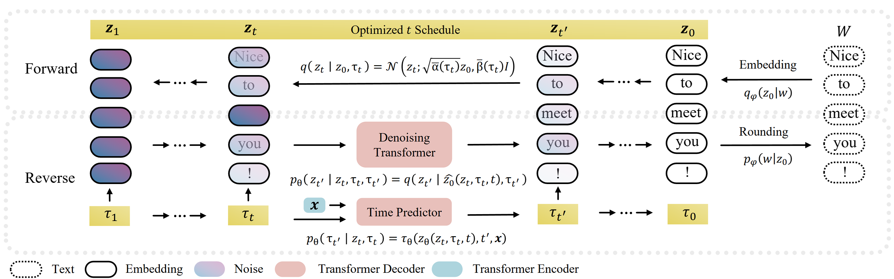

# Unifying Continuous and Discrete Text Diffusion with Non-simultaneous Diffusion Processes
[**ACL 2025 Oral Presentation**](https://arxiv.org/abs/2505.22165)  
[Bocheng Li](https://sites.google.com/view/bochengli)\*, [Zhujin Gao](https://scholar.google.com/citations?user=D97LBXMAAAAJ)\*, and [Linli Xu](http://staff.ustc.edu.cn/~linlixu)  
\* equal contribution

**tl;dr** We introduce NeoDiff, a continuous text diffusion model that integrates the per-token flexibility of discrete diffusion with the precise control of continuous diffusion using a non-simultaneous Poisson process and a semantically-aware time predictor with optimized noise schedule.


## Installation

1. Clone the repository:
   ```bash
   git clone https://github.com/bc-li/neodiff.git
   cd neodiff
   ```

2. Set up the environment and install dependencies:
   ```bash
   # Get fairseq-0.12.2
   wget https://github.com/facebookresearch/fairseq/archive/refs/tags/v0.12.2.zip
   unzip v0.12.2.zip
   # Create a new conda environment
   conda create -n neodiff python=3.8
   # Activate the environment
   conda activate neodiff
   # Install PyTorch 1.11
   conda install pytorch=1.11.0 -c pytorch
   # Downgrade MKL to resolve compatibility issues
   pip install mkl==2024.0.0
   # Install other dependencies
   pip install -r requirements.txt
   ```

## Quick Start

### Data Preparation

1. Prepare the IWSLT14 DE-EN dataset by following the instructions in [fairseq](https://github.com/facebookresearch/fairseq/tree/main/examples/translation#iwslt14-german-to-english-transformer).  
   Note: Knowledge distillation is not required; use the default settings.

2. Place the preprocessed data in the `data-bin` folder.

### Training

Train the NeoDiff model on the IWSLT14 DE-EN dataset using a single GPU:
```bash
bash scripts/iwslt14_de_en/train_neodiff.sh
```

### Evaluation

Evaluate the trained model on IWSLT14 DE-EN dataset using default setting:
```bash
bash scripts/iwslt14_de_en/evaluate_neodiff.sh
```

### Post-training Optimization

Optimize the time schedule for better performance using Bayesian optimization:
```bash
bash scripts/iwslt14_de_en/optimize_neodiff.sh
```

### LLM-based Evaluation

Evaluate the trained model on IWSLT14 DE-EN dataset using LLM-based evaluation:
```bash
bash scripts/iwslt14_de_en/llm_eval.py <path_to_generated_file.txt>
```

## Citation
If you find our work useful, please consider citing:
```bibtex
@inproceedings{li-etal-2025-unifying,
    title = "Unifying Continuous and Discrete Text Diffusion with Non-simultaneous Diffusion Processes",
    author = "Li, Bocheng  and
      Gao, Zhujin  and
      Xu, Linli",
    editor = "Che, Wanxiang  and
      Nabende, Joyce  and
      Shutova, Ekaterina  and
      Pilehvar, Mohammad Taher",
    booktitle = "Proceedings of the 63rd Annual Meeting of the Association for Computational Linguistics (Volume 1: Long Papers)",
    month = jul,
    year = "2025",
    address = "Vienna, Austria",
    publisher = "Association for Computational Linguistics",
    url = "https://aclanthology.org/2025.acl-long.565/",
    doi = "10.18653/v1/2025.acl-long.565",
    pages = "11530--11551",
}
```

